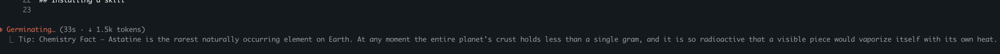

# skills

A collection of [Claude Code](https://claude.com/claude-code) skills.

## Skills

### `coding-mentor`
Turns coding work into active learning instead of passive delegation. While
writing or changing code, Claude explains the reasoning and tradeoffs in a
strictly technical register and pauses at genuine decision points to ask you a
question — so your engineering judgment stays sharp instead of atrophying.
Dials back automatically when you say you're in a hurry.

### `facts-spinner`
Shows true, interesting facts on the "Tip:" line beneath Claude Code's spinner
while it works — from subjects you pick (history, space, biology, math, art, and
more), in short or in-depth form. Facts are written from Claude's own knowledge
(no web calls, no approval prompts) into your `spinnerTipsOverride` setting,
leaving the glowing spinner word at its defaults. Run it, tick your subjects in a
checkbox prompt, choose short or in-depth, then start a new session to see them.



## Installing a skill

Each top-level folder is a self-contained skill. To install one globally (so
it's available in every Claude Code session on your machine), copy its folder
into `~/.claude/skills/`:

```bash
git clone https://github.com/shaqhacks/skills.git
cp -R skills/coding-mentor ~/.claude/skills/
cp -R skills/facts-spinner ~/.claude/skills/
```

Skills are picked up at the start of a new session. Invoke one explicitly with
`/coding-mentor` or `/facts-spinner`, or let it trigger automatically based on
its description.

## License

[MIT](./LICENSE)
